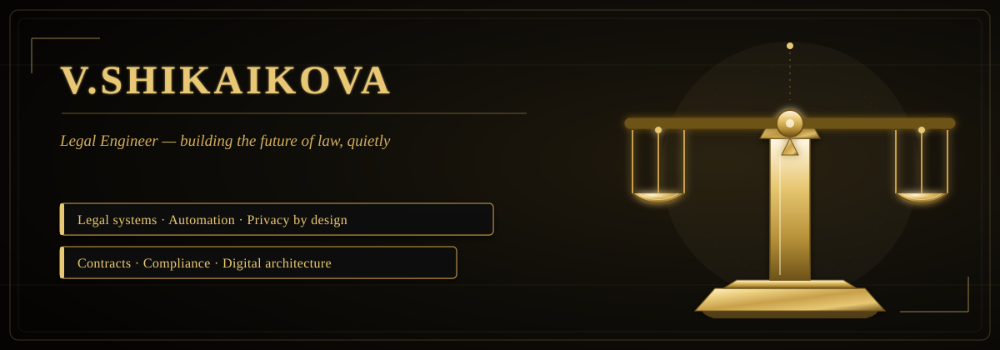
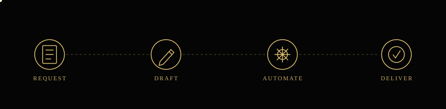

# Viktoria Shikaikova
### *Legal Engineer · LegalTech Developer*

  

### ⚖️ About Me

I'm a law graduate who taught myself to code after watching lawyers manually retype the same clauses for the hundredth time — I build tools that sit exactly between legal practice and software: contract generators, document trackers, small internal apps that save people from doing the boring part twice.

Finishing my law degree in Saint Petersburg while working as a freelance legal engineer, and looking for a place where those two skill sets get to work together for real.

`100% REMOTE` &nbsp;·&nbsp; `FULL-TIME OR 6+ MONTH PROJECT` &nbsp;·&nbsp; `LEGALTECH & CONTRACT AUTOMATION`

> *"Written laws are like spiders' webs — they hold the weak, and are torn apart by the powerful."* Which is exactly the kind of asymmetry I build software to close.

### 🗺️ How I Work

  

### 🗂️ Featured Projects

<table>
<tr>
<td width="50%" valign="top">

**Contract Automation Tool** · 2025

Fill in a form, pick from dropdowns — get a ready-to-sign `.docx` contract. Built after drafting the same NDA for the fifth time in a week.

*Impact*
- Cuts drafting time by 40–60%
- Used by 3 small firms so far

`HTML` `CSS` `JS` `Serverless`

</td>
<td width="50%" valign="top">

**Legal Case Tracker** · 2024

Mini CRM for solo practitioners — tracks deadlines, parties, and document statuses. Made it for myself first, turned out other freelance lawyers wanted it too.

*Impact*
- Replaced a messy spreadsheet workflow
- Now used by 2 other freelancers

`JavaScript` `Pet project`

</td>
</tr>
</table>

### 🧰 Tech Stack

**Development**

**Legal Toolkit**

### 📊 GitHub Activity

### 📜 Experience

**Legal Engineer · Freelance** — *2025 – present*
Small law firms kept asking me to draft the same contracts over and over, so I started building generators instead — Google Docs + Apps Script, cuts drafting time by ~40–60%. Still do full-cycle legal work on the side: contracts, claims, legal opinions, pre-trial letters.

**Web Developer, Legal & Business Projects** — *2024 – present*
4 sites/landing pages with working feedback & application forms — nothing fancy, but they convert. One was for a legal advisory service, hooked up to a Telegram bot so leads get an instant reply. Also built a small internal dashboard (vanilla JS) for tracking documents.

**Court Administration Assistant** — *2022 – 2023*
Drafted procedural docs, organized case files, kept the correspondence registers in order. Watched judges and staff drown in paperwork that could've been half a script — that's basically why LegalTech became the plan.

### 🎓 Education

**Russian State University of Justice (RGPU), Saint Petersburg**
Bachelor's in Law · 2023 – 2026
*Civil Law · Civil Procedure · Contract Law · Corporate Law · Banking & Finance Law basics*

### 📖 Beyond Law

|  |  |  |
|:---:|:---:|:---:|
| 📚 Reading legal history | ✈️ Travel | ♟️ Chess |

### 🌐 Languages

Russian — native &nbsp;·&nbsp; English — B2

### 📬 Let's Connect

